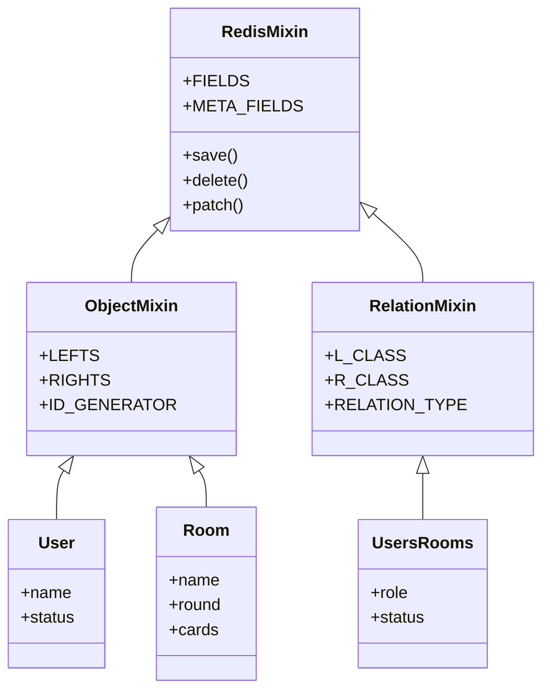
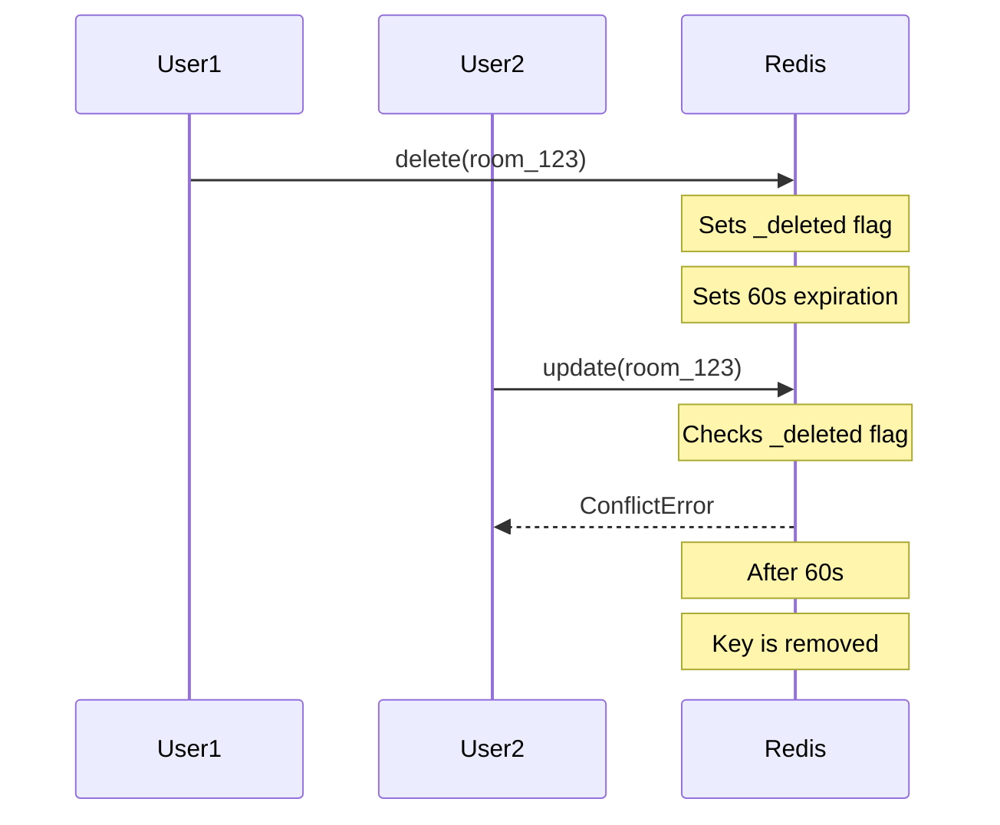
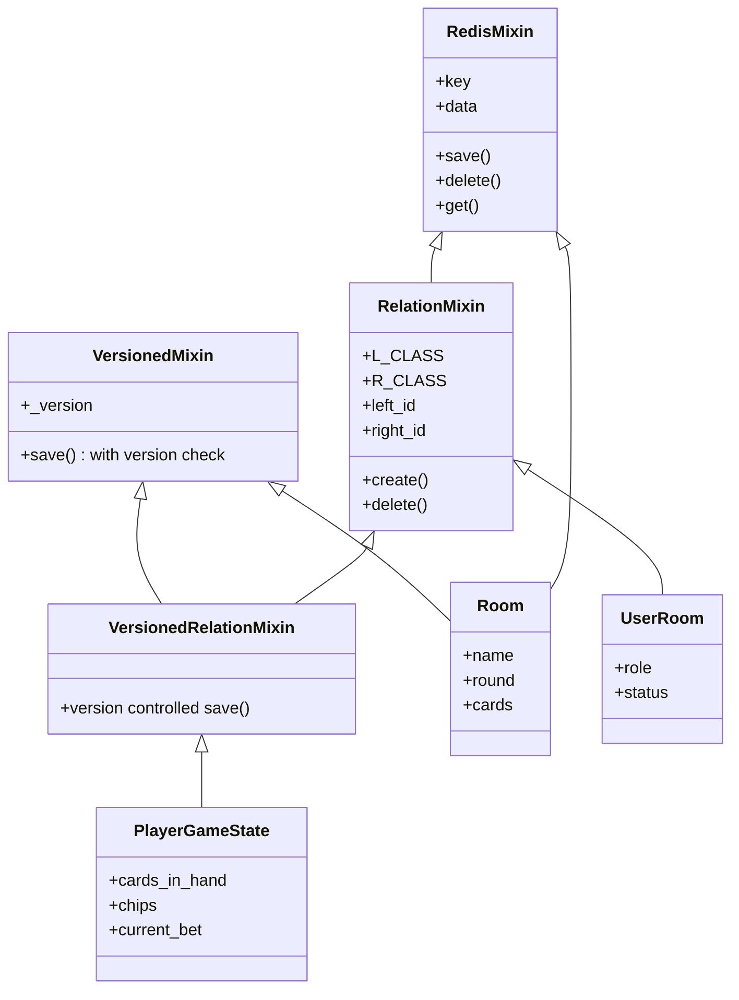

# Redis ORM Architecture

This document explains the Redis-based ORM system used in Tapis Vert for managing game state and relationships.

## Overview

The ORM is designed for low-latency operations in a collaborative environment where multiple users can modify the same data concurrently. It uses Redis as the primary database and implements optimistic locking and soft deletes to handle concurrent modifications safely.

## Class Structure



## Concurrent Operations

The system handles concurrent operations through optimistic locking and soft deletes. Here's how a concurrent delete scenario is handled:



## Key Features

1. **Optimistic Locking**
   - Each object maintains a version number
   - Updates check version before applying changes
   - Prevents lost updates in concurrent scenarios

2. **Soft Deletes**
   - Objects are marked as deleted with a TTL
   - Prevents zombie updates during deletion grace period
   - Automatic cleanup after expiration

3. **Relationship Management**
   - Supports one-to-many and many-to-many relationships
   - Relationships can carry their own data
   - Automatic relationship cleanup on deletion

## Usage Example

```python
# Creating a room
room = Room.create(name="Poker Table 1")

# Adding a user to the room
user = User.create(name="Alice")
UsersRooms.create(
    left_id=user.id,  # User
    right_id=room.id, # Room
    role="player",
    status="online"
)

# Updating room state with version check
room.cards = deal_new_hand()
room.save()  # Will raise ConflictError if version mismatch

# Safe deletion with grace period
room.delete()  # Sets _deleted flag and 60s TTL
```

## Performance Considerations

1. **Redis Pipelining**
   - Multiple operations are batched when possible
   - Reduces network roundtrips
   - Used in save(), delete(), and relationship operations

2. **Optimistic vs Pessimistic Locking**
   - System uses optimistic locking (version checks)
   - Better performance than locks in low-contention scenarios
   - May require retry logic in high-contention cases

3. **Soft Delete Overhead**
   - 60-second TTL on deleted objects
   - Small memory overhead for deleted objects
   - Tradeoff for concurrent operation safety

---

## Appendix: Future Work & TODOs

> **Note**: This section contains proposed improvements and alternative designs for the Redis ORM system. These are considerations for future development and refactoring.

### Why Redis Over Traditional RDBMS?

The choice of Redis as primary database (instead of a traditional RDBMS like PostgreSQL) is driven by our specific requirements:

#### 1. Concurrency Model Match
- **Atomic Operations**: Redis's native atomic operations are perfect for "last-write-wins" cases (e.g., player status updates)
- **Built-in TTL**: Efficient support for our soft-delete pattern with automatic cleanup
- **Optimistic Locking**: Light-weight WATCH/MULTI/EXEC pattern for versioned updates
- **Pipelining**: Efficient batching of related operations

#### 2. Data Access Patterns
Our application characteristics align perfectly with Redis:
- Frequent, small updates (player status, game state)
- Real-time state management
- Key-value oriented data (room state, user state)
- No complex joins or aggregations needed

#### 3. Performance Profile
Our needs:
```python
# Quick state updates - perfect for Redis
class UserRoom(RelationMixin):
    def set_status(self, status):
        REDIS_CLIENT.hset(self.key, "status", status)

# Real-time game state - benefits from in-memory access
class Room(RedisMixin, VersionedMixin):
    def new_round(self):
        with REDIS_CLIENT.pipeline() as pipe:
            # Atomic game state update
            # Version control
            # TTL for abandoned games
            pass
```

#### When Would PostgreSQL Make Sense?
Only if we later need:
```python
# Complex Analytics
class GameAnalytics:
    def get_player_statistics(self):
        """
        SELECT user_id, 
               COUNT(games) as games_played,
               AVG(score) as avg_score
        FROM game_history
        GROUP BY user_id
        HAVING games_played > 10
        """
        pass

# Strong Consistency Across Relations
class Tournament:
    def register_team(self):
        """
        BEGIN TRANSACTION
            INSERT INTO teams...
            UPDATE player_rankings...
            UPDATE tournament_brackets...
        COMMIT
        """
        pass
```

In such cases, Postgres could be added as a secondary database while keeping Redis for real-time game state.

### TODO: Redis-Native Relationships

While the current implementation uses key patterns for relationships, we could leverage Redis Sets for more efficient bidirectional navigation:

#### Current Approach (Using Key Patterns)
```python
class RelationMixin:
    @classmethod
    def rights(cls, left_id: str) -> dict[str, "RelationMixin"]:
        pattern = f"{cls.NAME}:{left_id}:*"
        cursor = 0
        relations = {}
        
        # O(N) complexity where N is total Redis keyspace
        while True:
            cursor, keys = REDIS_CLIENT.scan(
                cursor, 
                match=pattern,
                count=1000
            )
            for key in keys:
                right_id = key.split(":")[-1]
                relations[right_id] = cls.get_by_ids(left_id, right_id)
            if cursor == 0:
                break
                
        return relations
```

#### Proposed Set-Based Approach
```python
class SetBasedRelationMixin:
    """Redis-native relationship management using Sets"""
    
    @classmethod
    def create(cls, left_id, right_id, **data):
        with REDIS_CLIENT.pipeline() as pipe:
            # Store relation data
            key = f"relation:{cls.NAME}:{left_id}:{right_id}"
            pipe.hset(key, mapping=data)
            
            # O(1) bidirectional indexes
            pipe.sadd(f"{cls.L_CLASS.__name__.lower()}:{left_id}:rights", right_id)
            pipe.sadd(f"{cls.R_CLASS.__name__.lower()}:{right_id}:lefts", left_id)
            pipe.execute()
    
    @classmethod
    def rights(cls, left_id):
        # O(1) to access set, O(M) to return M members
        key = f"{cls.L_CLASS.__name__.lower()}:{left_id}:rights"
        right_ids = REDIS_CLIENT.smembers(key)
        
        return {
            right_id: cls.get_by_ids(left_id, right_id)
            for right_id in right_ids
        }
    
    @classmethod
    def delete(cls, left_id, right_id):
        with REDIS_CLIENT.pipeline() as pipe:
            # Remove relation data
            key = f"relation:{cls.NAME}:{left_id}:{right_id}"
            pipe.delete(key)
            
            # Remove from indexes
            pipe.srem(f"{cls.L_CLASS.__name__.lower()}:{left_id}:rights", right_id)
            pipe.srem(f"{cls.R_CLASS.__name__.lower()}:{right_id}:lefts", left_id)
            pipe.execute()
```

#### Performance Comparison

1. **Current Pattern-Based Approach**
   - Fetching relations: O(N) where N is total Redis keyspace
   - Must scan ALL keys to find matches
   - Gets slower as Redis instance grows
   - More flexible for complex patterns

2. **Set-Based Approach**
   - Fetching relations: O(M) where M is number of relations
   - Direct access to related IDs
   - Constant time regardless of Redis size
   - More memory for indexes

#### Extended Features with Sets

1. **Ordered Relationships** (using Sorted Sets):
```python
class OrderedRelationMixin(SetBasedRelationMixin):
    @classmethod
    def create(cls, left_id, right_id, **data):
        with REDIS_CLIENT.pipeline() as pipe:
            # Store relation data
            key = f"relation:{cls.NAME}:{left_id}:{right_id}"
            pipe.hset(key, mapping=data)
            
            # Ordered indexes using timestamp
            score = utils.now()
            pipe.zadd(f"{cls.L_CLASS.__name__.lower()}:{left_id}:rights", {right_id: score})
            pipe.zadd(f"{cls.R_CLASS.__name__.lower()}:{right_id}:lefts", {left_id: score})
            pipe.execute()
    
    @classmethod
    def rights(cls, left_id, newest_first=True):
        key = f"{cls.L_CLASS.__name__.lower()}:{left_id}:rights"
        return REDIS_CLIENT.zrange(key, 0, -1, desc=newest_first)
```

2. **Role-Based Relations** (using multiple sets):
```python
class UserRoomRelation(SetBasedRelationMixin):
    @classmethod
    def set_role(cls, user_id, room_id, new_role, old_role=None):
        with REDIS_CLIENT.pipeline() as pipe:
            # Update role sets
            if old_role:
                pipe.srem(f"room:{room_id}:{old_role}s", user_id)
            pipe.sadd(f"room:{room_id}:{new_role}s", user_id)
            
            # Update relation data
            key = f"relation:{cls.NAME}:{user_id}:{room_id}"
            pipe.hset(key, "role", new_role)
            pipe.execute()
    
    @classmethod
    def get_room_players(cls, room_id):
        return REDIS_CLIENT.smembers(f"room:{room_id}:players")
```

### TODO: Simplified Class Structure

#### Proposed Class Structure



#### Key Simplifications

1. **Base Functionality (RedisMixin)**
   - Handles basic CRUD operations
   - Maintains soft delete safety
   - Simpler interface

```python
class RedisMixin:
    def delete(self):
        """Two-phase delete that prevents zombie updates"""
        with REDIS_CLIENT.pipeline() as pipe:
            pipe.hset(self.key, "_deleted_at", utils.now())
            pipe.expire(self.key, DEL_EXPIRE)
            pipe.execute()

    @classmethod
    def get(cls, key):
        with REDIS_CLIENT.pipeline() as pipe:
            pipe.exists(key)
            pipe.hget(key, "_deleted_at")
            pipe.hgetall(key)
            exists, is_deleted, data = pipe.execute()
            
        if not exists or is_deleted:
            return None
            
        return cls(key=key, data=data)
```

2. **Optional Version Control**
   - Version checking only where needed
   - Simpler models for non-versioned data

```python
class Room(RedisMixin, VersionedMixin):  # Needs version control
    FIELDS = {"name", "round", "cards"}
    
class UserRoom(RelationMixin):  # Simple relation, no version needed
    L_CLASS = User
    R_CLASS = Room
    FIELDS = {"role", "status"}
```

### TODO: Selective Versioning Strategy

#### Objects That Need Versioning
- Multiple fields that must be updated together atomically
- Updates that depend on previous state
- Order of updates matters

Example:
```python
class Room(RedisMixin, VersionedMixin):
    FIELDS = {"name", "round", "cards"}
    # Needs versioning because:
    # - Game state must be consistent
    # - Card deals depend on previous state
    # - Round order matters
```

#### Objects That Don't Need Versioning
1. **Create/Delete Only**
```python
class Code(RedisMixin):  # No version needed
    ID_GENERATOR = utils.new_sid
    # Magic links are write-once, then only read/delete
```

2. **Last-Write-Wins Acceptable**
```python
class User(RedisMixin):  # No version needed
    FIELDS = {"name", "status"}
    
    def set_status(self, status):
        # Atomic operation, latest status wins
        REDIS_CLIENT.hset(self.key, "status", status)
```

3. **Append-Only Data**
```python
class GameLog(RedisMixin):  # No version needed
    @classmethod
    def append(cls, game_id, event):
        # Redis RPUSH is atomic
        REDIS_CLIENT.rpush(f"game:{game_id}:log", json.dumps(event))
```

#### Relations and Versioning

Relations can optionally use versioning through `VersionedRelationMixin`:

```python
class VersionedRelationMixin(RelationMixin, VersionedMixin):
    """Base class for relations that need version control"""
    pass

# Relation needing versioning (complex state)
class PlayerGameState(VersionedRelationMixin):
    FIELDS = {"cards_in_hand", "chips", "current_bet"}
    L_CLASS = Player
    R_CLASS = Game
    
    def place_bet(self, amount):
        if amount > self.chips:
            raise ValueError("Not enough chips")
        self.current_bet = amount
        self.chips -= amount
        self.save()  # Uses versioned save

# Simple relation (no versioning needed)
class UserRoom(RelationMixin):
    FIELDS = {"role", "status"}
    L_CLASS = User
    R_CLASS = Room
    
    @classmethod
    def set_role(cls, user_id, room_id, role):
        # Atomic operation, no version needed
        key = cls._key(user_id, room_id)
        REDIS_CLIENT.hset(key, "role", role)
```

### TODO: Migration Strategy

#### Phase 1: Add New Mixins
- Introduce RedisMixin, VersionedMixin, and VersionedRelationMixin
- Keep existing functionality working

#### Phase 2: Migrate Objects
- Identify which objects need versioning
- Update class inheritance
- Test concurrent operations

#### Phase 3: Migrate Relations
- Convert simple relations to use atomic operations
- Add versioning only where needed
- Verify relationship integrity

#### Phase 4: Cleanup
- Remove unused metaclass machinery
- Simplify relationship registration
- Update documentation

### TODO: Testing & Validation

#### Concurrent Operation Tests
- Verify soft delete behavior
- Test version conflicts
- Check atomic operations

#### Relationship Tests
- Test versioned relations
- Verify atomic updates
- Check referential integrity

#### Performance Tests
- Compare latency with current implementation
- Measure Redis memory usage
- Test under high concurrency

### TODO: Memory Impact Analysis

#### Migration Considerations

1. **Memory Impact**
   - Additional memory for indexes
   - Roughly 2x more keys (relation + indexes)
   - Offset by faster access patterns

2. **Atomic Operations**
   - All operations use Redis pipelines
   - Maintains ACID properties
   - More complex atomic updates

3. **Gradual Migration Path**
   - Can run both systems in parallel
   - Migrate one relation type at a time
   - Backfill indexes for existing relations

### Benefits of Proposed Simplification

1. **Clearer Code Path**
   - Each mixin has a single responsibility
   - Easier to understand and maintain
   - Still maintains concurrent safety

2. **Flexible Version Control**
   - Optional versioning where needed
   - Reduced overhead for simple objects
   - Cleaner model definitions

3. **Simpler Relationship Management**
   - Direct relationship creation
   - Maintains referential integrity
   - Less metaclass machinery

#### Usage Example

```python
# Basic usage (no version control needed)
user = User.create(name="Alice")

# Version-controlled room
room = Room.create(name="Poker Table 1")
room.cards = deal_new_hand()
room.save()  # Includes version check

# Simple relationship
UserRoom.create(
    left_id=user.id,
    right_id=room.id,
    role="player"
)
``` 